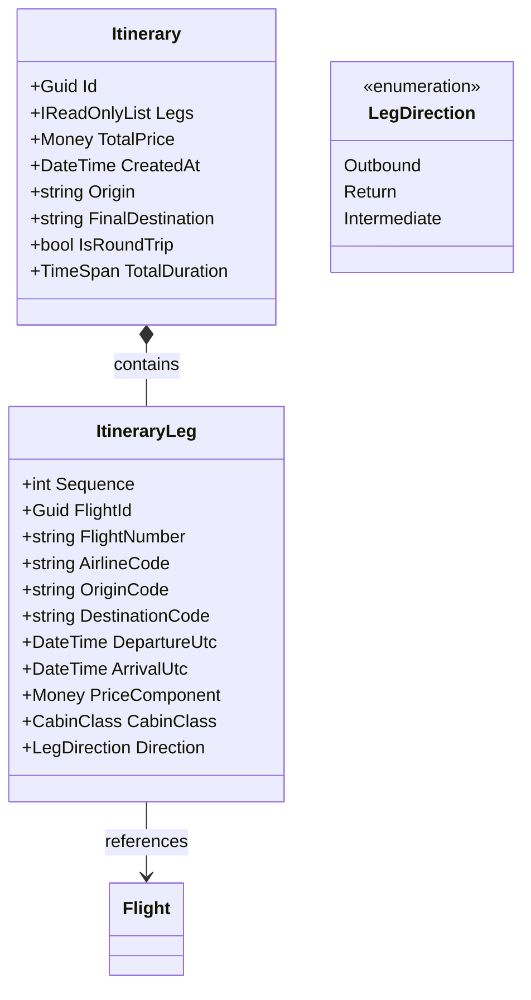

# FlightTracker Domain - Class Diagram

This document provides a comprehensive class diagram for the FlightTracker Domain project, showing the relationships between entities, value objects, services, repositories, and events.

## Domain Architecture Overview

The domain follows Domain-Driven Design (DDD) principles with clear separation of concerns:

- **Entities**: Core business objects with identity
- **Value Objects**: Immutable objects without identity
- **Services**: Domain logic that doesn't belong to entities
- **Repositories**: Data access abstractions
- **Events**: Domain events for cross-cutting concerns
- **Enums**: Shared enumerations

## Class Diagram (Mermaid)

```mermaid
classDiagram
    %% Core Entities
    class Flight {
        +Guid Id
        +string FlightNumber
        +string AirlineCode
        +string AirlineName
        +Airport Origin
        +Airport Destination
        +DateTime DepartureTime
        +DateTime ArrivalTime
        +TimeSpan Duration
        +List~FlightSegment~ Segments
        +Money Price
        +CabinClass CabinClass
        +string DeepLink
        +int Stops
        +FlightStatus Status
        +DateTime CreatedAt
        +Flight(flightNumber, airlineCode, airlineName, origin, destination, departureTime, arrivalTime, price, cabinClass, deepLink, status)
        +AddSegment(segment)
        +UpdatePrice(newPrice)
        +UpdateStatus(newStatus)
        +UpdateDeepLink(deepLink)
        +bool IsDirect
        +bool IsInternational
    }

    class Airport {
        +string Code
        +string Name
        +string City
        +string Country
        +decimal Latitude
        +decimal Longitude
        +string Timezone
        +Airport(code, name, city, country, latitude, longitude, timezone)
        +UpdateLocation(latitude, longitude, timezone)
    }

    class Airline {
        +string Code
        +string Name
        +string LogoUrl
        +Airline(code, name, logoUrl)
        +UpdateLogo(logoUrl)
    }

    class FlightSegment {
        +int Id
        +Guid FlightId
        +string FlightNumber
        +string AirlineCode
        +string OriginCode
        +string DestinationCode
        +Airport Origin
        +Airport Destination
        +Airline Airline
        +DateTime DepartureTime
        +DateTime ArrivalTime
        +TimeSpan Duration
        +string AircraftType
        +int SegmentOrder
        +FlightStatus Status
        +FlightSegment(flightNumber, airlineCode, origin, destination, departureTime, arrivalTime, segmentOrder, aircraftType, status)
        +UpdateStatus(newStatus)
        +UpdateAircraftType(aircraftType)
    }

    class FlightQuery {
        +Guid Id
        +string OriginCode
        +string DestinationCode
        +Airport Origin
        +Airport Destination
        +DateTime DepartureDate
        +DateTime ReturnDate
        +DateTime CreatedAt
        +int SearchCount
        +DateTime LastSearchedAt
        +string UserId
        +List~PriceSnapshot~ PriceSnapshots
        +FlightQuery(originCode, destinationCode, departureDate, returnDate)
        +IncrementSearchCount()
        +SetUserId(userId)
        +AddPriceSnapshot(priceSnapshot)
        +bool IsRoundTrip
    }

    class PriceSnapshot {
        +long Id
        +Guid QueryId
        +FlightQuery FlightQuery
        +string AirlineCode
        +Airline Airline
        +CabinClass Cabin
        +Money Price
        +string DeepLink
        +string FlightNumber
        +DateTime DepartureTime
        +DateTime ArrivalTime
        +int Stops
        +DateTime CollectedAt
        +PriceSnapshot(queryId, airlineCode, cabin, price, deepLink, flightNumber, departureTime, arrivalTime, stops)
        +Restore(id, queryId, airlineCode, cabin, price, deepLink, flightNumber, departureTime, arrivalTime, stops, collectedAt)$
        +TimeSpan Duration
        +bool IsDirect
    }

    %% Value Objects
    class Money {
        <<Value Object>>
        +decimal Amount
        +string Currency
        +Money(amount, currency)
        +Create(amount, currency)$
        +Zero(currency)$
        +Add(other) Money
        +Subtract(other) Money
        +Multiply(factor) Money
        +Equals(other) bool
    }

    class RouteKey {
        <<Value Object>>
        +string OriginCode
        +string DestinationCode
        +bool IsRoundTrip
        +RouteKey(originCode, destinationCode, isRoundTrip)
        +OneWay(originCode, destinationCode)$
        +RoundTrip(originCode, destinationCode)$
        +Reverse() RouteKey
        +ToShortString() string
        +Equals(other) bool
    }

    class DateRange {
        <<Value Object>>
        +DateTime StartDate
        +DateTime EndDate
        +int Days
        +DateRange(startDate, endDate)
        +SingleDay(date)$
        +FromDeparture(departureDate, returnDate)$
        +Contains(date) bool
        +Overlaps(other) bool
        +Equals(other) bool
    }

    class FlightSearchOptions {
        <<Value Object>>
        +FlightSortBy SortBy
        +SortOrder SortOrder
        +int Page
        +int PageSize
        +int MaxResults
        +Default$
        +WithSorting(sortBy, sortOrder)$
        +WithPagination(page, pageSize)$
        +Create(sortBy, sortOrder, page, pageSize, maxResults)$
        +int Skip
        +IsValid() bool
    }

    class PriceTrendData {
        <<Value Object>>
        +DateTime Date
        +Money MinPrice
        +Money MaxPrice
        +Money AvgPrice
        +Money MedianPrice
        +int SampleCount
        +PriceTrendData(date, minPrice, maxPrice, avgPrice, medianPrice, sampleCount)
    }

    class AirlinePerformance {
        <<Value Object>>
        +string AirlineCode
        +string AirlineName
        +Money AveragePrice
        +Money MinPrice
        +Money MaxPrice
        +int FlightCount
        +double AverageStops
        +AirlinePerformance(airlineCode, airlineName, averagePrice, minPrice, maxPrice, flightCount, averageStops)
    }

    %% Enums
    class CabinClass {
        <<Enumeration>>
        Economy
        PremiumEconomy
        Business
        First
    }

    class FlightStatus {
        <<Enumeration>>
        Scheduled
        Delayed
        Boarding
        InFlight
        Landed
        Cancelled
        Diverted
    }

    class FlightSortBy {
        <<Enumeration>>
        Price
        Duration
        Stops
        DepartureTime
        ArrivalTime
        Airline
    }

    class SortOrder {
        <<Enumeration>>
        Ascending
        Descending
    }

    %% Services
    class IFlightService {
        <<Interface>>
        +SearchFlightsAsync(originCode, destinationCode, departureDate, returnDate, searchOptions, cancellationToken)
        +GetFlightDetailsAsync(flightNumber, airlineCode, departureDate, cancellationToken)
    }

    class IFlightProvider {
        <<Interface>>
        +string ProviderName
        +SearchFlightsAsync(originCode, destinationCode, departureDate, returnDate, cancellationToken)
        +IsAvailableForRouteAsync(originCode, destinationCode, cancellationToken)
    }

    class ICacheService {
        <<Interface>>
        +GetAsync~T~(key, cancellationToken)
        +SetAsync~T~(key, value, expiration, cancellationToken)
        +RemoveAsync(key, cancellationToken)
    }

    class IPriceAnalysisService {
        <<Interface>>
        +GetPriceTrendsAsync(routeKey, dateRange, cancellationToken)
        +GetAirlinePerformanceAsync(routeKey, dateRange, cancellationToken)
        +GetPriceForecastAsync(routeKey, targetDate, cancellationToken)
    }

    %% Repositories
    class IFlightRepository {
        <<Interface>>
        +SearchAsync(originCode, destinationCode, departureDate, returnDate, searchOptions, cancellationToken)
        +GetByIdAsync(id, cancellationToken)
        +GetByFlightNumberAsync(flightNumber, airlineCode, departureDate, cancellationToken)
        +AddAsync(flight, cancellationToken)
        +UpdateAsync(flight, cancellationToken)
        +DeleteAsync(id, cancellationToken)
        +GetByRouteAsync(originCode, destinationCode, days, cancellationToken)
        +GetRecentFlightsAsync(count, cancellationToken)
    }

    class IFlightQueryRepository {
        <<Interface>>
        +GetByRouteAndDateAsync(originCode, destinationCode, departureDate, returnDate, cancellationToken)
        +AddAsync(query, cancellationToken)
        +UpdateAsync(query, cancellationToken)
        +GetPopularRoutesAsync(days, count, cancellationToken)
        +GetUserSearchHistoryAsync(userId, count, cancellationToken)
    }

    class IPriceSnapshotRepository {
        <<Interface>>
        +AddAsync(snapshot, cancellationToken)
        +GetByQueryIdAsync(queryId, cancellationToken)
        +GetPriceHistoryAsync(originCode, destinationCode, departureDate, days, cancellationToken)
        +GetLowestPricesAsync(originCode, destinationCode, dateRange, cancellationToken)
        +GetPriceTrendsAsync(routeKey, dateRange, cancellationToken)
    }

    class IAirportRepository {
        <<Interface>>
        +GetByCodeAsync(code, cancellationToken)
        +SearchByNameAsync(searchTerm, cancellationToken)
        +GetAllAsync(cancellationToken)
        +AddAsync(airport, cancellationToken)
        +UpdateAsync(airport, cancellationToken)
    }

    class IAirlineRepository {
        <<Interface>>
        +GetByCodeAsync(code, cancellationToken)
        +GetAllAsync(cancellationToken)
        +AddAsync(airline, cancellationToken)
        +UpdateAsync(airline, cancellationToken)
    }

    %% Events
    class DomainEvent {
        <<Abstract>>
        +Guid Id
        +DateTime OccurredAt
        #DomainEvent()
    }

    class FlightSearchPerformedEvent {
        +FlightQuery Query
        +int ResultCount
        +TimeSpan SearchDuration
        +FlightSearchPerformedEvent(query, resultCount, searchDuration)
    }

    class PriceSnapshotCollectedEvent {
        +PriceSnapshot Snapshot
        +PriceSnapshotCollectedEvent(snapshot)
    }

    %% Relationships (fixed syntax)
    Flight "1" *-- "many" FlightSegment : contains
    Flight "1" --> "1" Airport : origin/destination
    Flight "1" *-- "1" Money : price
    Flight "1" --> "1" CabinClass : cabin
    Flight "1" --> "1" FlightStatus : status

    FlightSegment "1" --> "1" Airport : origin/destination
    FlightSegment "1" --> "1" Airline : airline
    FlightSegment "1" --> "1" FlightStatus : status

    FlightQuery "1" *-- "many" PriceSnapshot : tracks
    FlightQuery "1" --> "1" Airport : origin/destination

    PriceSnapshot "1" --> "1" Airline : airline
    PriceSnapshot "1" *-- "1" Money : price
    PriceSnapshot "1" --> "1" CabinClass : cabin

    FlightSearchOptions "1" --> "1" FlightSortBy : sort by
    FlightSearchOptions "1" --> "1" SortOrder : sort order

    PriceTrendData ..> Money : prices
    AirlinePerformance ..> Money : prices

    FlightSearchPerformedEvent --> FlightQuery : query
    PriceSnapshotCollectedEvent --> PriceSnapshot : snapshot

    DomainEvent <|-- FlightSearchPerformedEvent
    DomainEvent <|-- PriceSnapshotCollectedEvent

    %% Repository Dependencies
    IFlightRepository ..> Flight : manages
    IFlightQueryRepository ..> FlightQuery : manages
    IPriceSnapshotRepository ..> PriceSnapshot : manages
    IAirportRepository ..> Airport : manages
    IAirlineRepository ..> Airline : manages

    %% Service Dependencies
    IFlightService ..> Flight : returns
    IFlightService ..> FlightSearchOptions : uses
    IFlightProvider ..> Flight : returns
    IPriceAnalysisService ..> PriceTrendData : returns
    IPriceAnalysisService ..> AirlinePerformance : returns
    IPriceAnalysisService ..> RouteKey : uses
    IPriceAnalysisService ..> DateRange : uses
```

## Key Domain Concepts

### Entities

1. **Flight**: Core aggregate root representing a flight offering
   - Contains flight segments for multi-leg journeys
   - Tracks pricing, routing, and booking information
   - Maintains invariants around dates and routing logic

2. **Airport**: Reference entity for airport information
   - Immutable after creation (except location updates)
   - Used across multiple flights and segments

3. **Airline**: Reference entity for airline information
   - Simple entity with code, name, and logo
   - Referenced by flights and segments

4. **FlightSegment**: Individual leg of a journey
   - Part of Flight aggregate
   - Contains specific routing and timing information

5. **FlightQuery**: Tracks search requests for analytics
   - Aggregate root for price snapshots
   - Used for caching and trend analysis

6. **PriceSnapshot**: Historical price data point
   - Part of FlightQuery aggregate
   - Enables price trend analysis

### Value Objects

1. **Money**: Monetary amounts with currency
   - Implements proper equality and arithmetic operations
   - Prevents currency mixing operations

2. **RouteKey**: Represents flight routes
   - Supports one-way and round-trip variants
   - Used for caching and analytics grouping

3. **DateRange**: Time period representation
   - Used for search queries and analytics
   - Supports overlap and containment operations

4. **FlightSearchOptions**: Search and sorting preferences
   - Record type for immutability
   - Includes pagination and sorting logic

5. **Analytics Value Objects**: Price trends and airline performance
   - Used by analysis services
   - Immutable data transfer objects

### Services

1. **IFlightService**: Main flight search orchestration
2. **IFlightProvider**: Individual data source abstraction
3. **ICacheService**: Caching abstraction
4. **IPriceAnalysisService**: Analytics and trending
5. **IItinerarySearchService**: Builds composed itineraries (one-way, round-trip) from flights

### Events

1. **FlightSearchPerformedEvent**: Raised on searches
2. **PriceSnapshotCollectedEvent**: Raised on price data collection

### New Itinerary Aggregate

The itinerary aggregate groups flight legs into a journey (supports future multi-city):

Invariants:
- Legs ordered by contiguous Sequence starting at 0
- Temporal order: each leg departs after or at arrival of prior leg (no overlap)
- Round-trip requires last destination equals first origin
- Uniform currency across leg price components
- TotalPrice = sum(leg.PriceComponent)

## Aggregate Boundaries

- **Flight Aggregate**: Flight + FlightSegments
- **FlightQuery Aggregate**: FlightQuery + PriceSnapshots
- **Airport**: Single entity (reference data)
- **Airline**: Single entity (reference data)

## Design Patterns Used

- **Domain-Driven Design**: Clear separation of domain concepts
- **Aggregate Pattern**: Consistency boundaries and invariants
- **Repository Pattern**: Data access abstraction
- **Event-Driven Architecture**: Domain events for cross-cutting concerns
- **Value Object Pattern**: Immutable objects without identity
- **Factory Methods**: Static creation methods for complex objects
